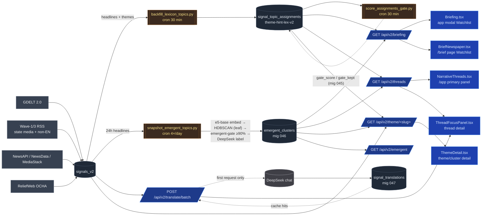

# Architecture — data flow

Hand-maintained, high-level. For a machine-verified map of which file
touches what, run `python scripts/project_inventory.py` and read
`docs/state/PROJECT_INVENTORY.md`. The previous v1-era document is
preserved under `docs/state/archive/ARCHITECTURE-v1-2025.md`.

## Signal classification pipeline (precision discipline)

1. **Lexicon + GDELT hint match (recall lever).** Every 30 min,
   `backfill_lexicon_topics.py` joins `signals_v2.themes` against
   `atlas_topics.gdelt_theme_hints` (set intersection) and tests
   `atlas_topics.lexicon_terms` against `lower(headline)`. Top-2 topics
   per signal, min confidence 0.65, idempotent upserts. Output:
   `signal_topic_assignments` rows tagged `method='lexicon'`,
   `model_version='theme-hint-lex-v2'`.

2. **Scope gate (precision lever, mig 045).** Same 30-min cron.
   `score_assignments_gate.py` reads every fresh assignment row, runs
   the persisted per-topic logistic gate
   (`docs/research/atlas-paper/phase-1-validation/models/2026-05-29-scope-gate-v1-e5base.json`),
   writes `gate_score / gate_kept / gate_model`. Per-topic thresholds
   calibrated to ≥90% precision on a 4,911-row 3-vendor consensus
   corpus; e5-base embeddings on MPS. AUC 0.940, OOF recall 0.749.

3. **Emergent layer (data-driven taxonomy).** 4× daily snapshot pulls
   24h of headlines, dedupes + cleans + embeds with the same
   multilingual e5-base encoder, clusters via HDBSCAN (leaf method),
   applies the cluster-agnostic emergent precision gate
   (`2026-05-30-emergent-precision-gate-v1.json`, AUC 0.946), labels
   surviving clusters with DeepSeek. Persists to `emergent_clusters`
   with sample headlines, centroid, gated/raw counts, top countries.

## API read surfaces

| Surface | Endpoint | Source |
|---|---|---|
| Brief modal Watchlist | `/api/v2/briefing.top_atlas_topics` | `emergent_clusters` latest snapshot ⟵ fallback ⟶ `signal_topic_assignments` |
| /brief newspaper page | same as above | same |
| Narrative Threads (primary /app panel) | `/api/v2/threads` | merged: atlas (`signal_topic_assignments` + aggregates) + emergent (`emergent_clusters`), sorted by `signal_count DESC`, trimmed |
| Thread focus | `/api/v2/threads/{thread_id}` | dispatch on prefix: `emergent-cluster-<id>` → `_fetch_emergent_thread_detail`; otherwise atlas |
| Theme/cluster detail | `/api/v2/theme/{slug}` | dispatch: `cluster-<id>` → `_emergent_cluster_detail`; atlas slug → `_atlas_topic_detail` (gate-aware on hot windows); historical slug → `query_historical_topic_detail`; GDELT code → raw `signals_v2.themes` scan |
| Emergent inspector | `/api/v2/emergent` | `emergent_clusters` latest snapshot |
| Translation | `/api/v2/translate?signal_id=...` | `signal_translations` cache → DeepSeek on miss |

## Crons (off-iCloud, `/Users/pedro/AtlasLocalWorker/`)

| Label | Cadence | Runner | What it writes |
|---|---|---|---|
| `com.atlas.atlas-topic-classifier` | every 30 min | `run-atlas-topic-classifier.sh` | `signal_topic_assignments` rows (backfill) + `gate_score/gate_kept` (scope gate) |
| `com.atlas.local-hot-cold-catchup` | 6×/day | `run-local-hot-cold-catchup.sh` | hot → cold archive prune |
| `com.atlas.emergent-snapshot` | 4×/day (0/6/12/18 local) | `run-emergent-snapshot.sh` | `emergent_clusters` rows (one snapshot per run) |

Verify with `launchctl list | grep atlas` and tail
`/Users/pedro/AtlasLocalWorker/logs/*.log`.

## Key design constraints

- **Precision discipline applies at two layers** with the same
  methodology: scope gate (atlas topic membership) and emergent gate
  (cluster membership). Both target ≥90% precision on held-out OOF
  predictions against the 3-vendor consensus corpus.
- **Atlas vs emergent is additive, not competing.** Brief and Threads
  merge both; the static atlas vocabulary acts as a curated watchlist
  while the emergent layer surfaces unknown narratives. Phase 6
  collapses them into a unified `dynamic_topics` lifecycle.
- **Local ML lives off-iCloud** (`/Users/pedro/AtlasLocalWorker/mlvenv`):
  iCloud evicts venv `.so`/`.py` files to dataless placeholders, which
  hangs torch/transformers/asyncpg imports at 0% CPU. All cron-fired
  Python (atlas-topic, emergent snapshot, scope-gate scoring) MUST run
  from the off-iCloud venv.
- **Cron secrets live off-Desktop** in `/Users/pedro/AtlasLocalWorker/.env`.
  Launchd runners must not read the Desktop repo `.env`; macOS privacy controls
  can block those reads with `Operation not permitted`.
- **Read paths degrade**, not error: missing `emergent_clusters` /
  `signal_topic_assignments` / `historical_topic_country_daily` →
  endpoints return empty arrays + typed warnings
  (`emergent_clusters_missing`, etc.), never 5xx.

## Where the bodies are buried

- `backend/app/services/thread_intelligence.py` — atlas thread
  assembly + emergent merge. Long file; `assemble_thread` and
  `assemble_emergent_thread` are the contract anchors.
- `backend/app/routers/themes.py` — three-way slug dispatch
  (`cluster-N`, atlas slug, GDELT code). New surfaces should add a
  branch above the GDELT fallback.
- `backend/app/routers/briefing.py` — `top_atlas_topics` block is the
  brief Watchlist feed; updates here change both the modal and /brief
  in lockstep.
- `backend/scripts/snapshot_emergent_topics.py` — production emergent
  writer; `_cluster_stats`, `_apply_gate`, `_label_all` come from
  `emergent_poc.py` to keep POC and prod aligned.
- `backend/scripts/train_*_gate.py` — gate training; calibration
  reports live next to the persisted artifacts under
  `docs/research/atlas-paper/phase-1-validation/models/`.

When in doubt, the inventory script is the cheapest way to confirm
"who reads X" / "who writes Y" before touching code.
