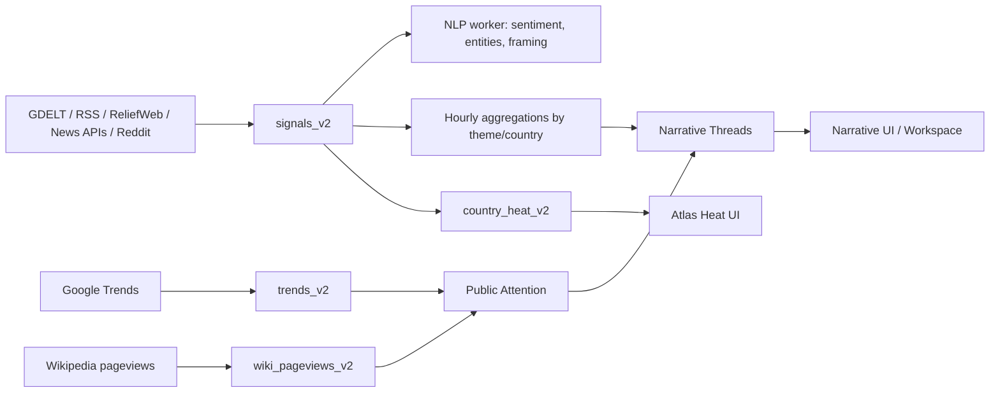

# Atlas Data Operating Model

Fecha: 2026-05-19  
Estado: documento de trabajo para revision de producto, datos y roadmap

## 1. Resumen ejecutivo

Atlas ya no es solamente un visor de volumen de noticias. La arquitectura actual tiene tres capas de datos:

1. **Senales de medios y eventos**: filas normalizadas en `signals_v2`. Aqui entran GDELT, RSS, ReliefWeb, NewsData.io, MediaStack, NewsAPI.org y Reddit.
2. **Atencion publica**: tablas separadas para Google Trends (`trends_v2`) y Wikipedia (`wiki_pageviews_v2`). Esta informacion representa busquedas, lecturas y curiosidad publica, no evidencia periodistica directa.
3. **Inteligencia derivada**: NLP multilingue, agregaciones por tema/pais/hora, narrativas, Atlas Heat y paneles visuales.

La conclusion importante es esta: **hoy las narrativas siguen estando dominadas por GDELT**, porque GDELT entra con taxonomia tematica desde origen. Las nuevas fuentes si estan llegando a produccion, pero muchas entran sin `themes`, entonces todavia no alimentan de forma fuerte los hilos narrativos. Reddit y las APIs nuevas existen en la base, pero no aparecen claramente en pantalla porque falta una capa de clasificacion, mezcla de voces y UI de procedencia.

La atencion publica de Google Trends y Wikipedia **no crea narrativas por si sola**. Actualmente solo anota narrativas existentes con senales tipo `SEARCH` o `WIKI` cuando encuentra coincidencias por palabras clave. Eso es util, pero todavia es debil: no cambia el ranking de narrativas, no agrupa hilos nuevos y no muestra bien la relacion entre "lo que publican los medios" y "lo que la gente esta buscando o leyendo".

## 2. Modelo conceptual

Atlas deberia entenderse como una plataforma que compara tres cosas:

- **Cobertura mediatica**: que temas estan siendo reportados y con que volumen.
- **Atencion publica**: que esta buscando o leyendo la gente.
- **Diversidad de voz**: desde donde viene la informacion, en que idioma, con que cercania geografica y con que tipo de fuente.

Hoy la primera capa esta mas madura que las otras dos.

## 3. Fuentes y uso actual

| Fuente | Donde queda | Frecuencia | Rol actual | Alimenta narrativas hoy | Visibilidad en UI | Limitacion principal |
|---|---:|---:|---|---|---|---|
| GDELT GKG | `signals_v2` | ~15 min | Backbone global de medios y temas | Si, fuerte | Alta | Puede sobrerrepresentar paises/fuentes con mas volumen mediatico |
| GDELT Events | `signals_v2` / servicios derivados | ~15 min | Eventos estructurados y geopoliticos | Parcial | Media | No siempre esta conectado a una historia legible para usuario |
| RSS curado | `signals_v2` | ~60 min | Fuentes seleccionadas, estatales, independientes, wire, NGO | Debil si entra sin `themes` | Baja/media | Falta clasificacion tematica consistente |
| ReliefWeb/OCHA | `signals_v2` | ~60 min | Capa humanitaria con buena precision geografica | Debil si entra sin `themes` | Baja | Excelente para crisis, pero falta hacerlo visible como voz humanitaria |
| NewsData.io | `signals_v2` | ~60 min | Diversidad idiomatica y regional | Muy debil ahora | Baja | Entra mayormente sin `themes`; batches por idioma mezclan geografias |
| MediaStack | `signals_v2` | ~2 horas | Cobertura LatAm/Iberia adicional | Muy debil ahora | Baja | Bajo presupuesto mensual y sin taxonomia tematica |
| NewsAPI.org | `signals_v2` | ~2 horas | Queries de crisis en ingles | Muy debil ahora | Baja | Queries hardcodeadas y redundantes con GDELT ingles |
| Reddit | `signals_v2` | ~60 min | Comentario social/geopolitico temprano | No de forma material | Muy baja | Entra como `social` pero sin `themes`; no debe mezclarse como evidencia factual |
| Google Trends | `trends_v2` | ~30 min | Busqueda y demanda publica | Solo como badge/annotacion | Media | No genera narrativas; matching por palabras es superficial |
| Wikipedia | `wiki_pageviews_v2` | ~24 horas | Lectura publica con retardo de 24h | Solo como badge/annotacion | Media | No es live; sirve para confirmar interes, no para detectar primero |
| ACLED | tablas/servicios de eventos | diario/periodico | Validacion de conflicto/eventos | Indirecto | Baja | Falta integrarlo mejor con narrativas y heat |

## 4. Que hacemos con cada senal

Las fuentes que representan articulos, posts o eventos se normalizan a `signals_v2`. La idea es que todas compartan un contrato comun:

- `source_family`: familia de fuente (`gdelt`, `api`, `social`, `wire`, `state`, `independent`, `ngo`, etc.).
- `source_lang`: idioma declarado o inferido.
- `geo_confidence`: confianza de asignacion geografica.
- `attribution_method`: metodo de origen (`gdelt_gkg`, `newsdata_api`, `reddit_public`, `rss_feed`, etc.).
- `is_state_media`: bandera para medios estatales cuando aplica.
- `themes`, `persons`, `organizations`, `locations`: taxonomia y entidades.
- `sentiment`, `tone`, `nlp_sentiment`, `nlp_framing`: analisis semantico.

Despues de entrar, el NLP worker procesa las senales en segundo plano:

- **Sentimiento multilingue** con XLM/RoBERTa.
- **NER** para personas, lugares y organizaciones.
- **Framing multilingue** con un modelo MiniLM mas liviano que el mDeBERTa anterior.

Esto ya esta encendido en produccion, pero el backlog es grande. Por eso, durante un tiempo vamos a tener mezcla de filas procesadas y no procesadas.

## 5. Como se construyen los hilos narrativos hoy

El endpoint `/api/v2/narratives` funciona principalmente asi:

1. Busca los temas mas fuertes en agregaciones horarias (`theme_hourly_v2` o `signals_theme_hourly`).
2. Consulta `signals_v2` para senales que tengan esos `themes`.
3. Agrupa esas senales en hilos narrativos con paises, personas, sentimiento, volumen y tendencia.
4. Cruza el label del tema con Google Trends y Wikipedia para marcar si hay atencion publica.
5. El frontend renderiza badges como `SEARCH` o `WIKI`.

Esto responde la pregunta central: **la informacion publica si se relaciona con los hilos narrativos, pero hoy solo como anotacion secundaria**. Google Trends y Wikipedia no estan decidiendo que hilos existen; solo dicen: "este hilo de medios parece tener tambien interes publico".

## 6. Por que Reddit y las nuevas APIs casi no se ven

La razon no es que no esten entrando. Si estan entrando. El problema es que no tienen la misma riqueza semantica que GDELT al momento de ingestarse.

Snapshot de produccion del 2026-05-19, ultimas 24 horas:

| Fuente/metodo | Filas | Filas sin `themes` | NLP procesado |
|---|---:|---:|---:|
| GDELT translated | 102,681 | 8,856 | 81 |
| GDELT GKG | 64,094 | 5,624 | 2,986 |
| RSS independent | 1,188 | 1,188 | 42 |
| NewsData.io | 488 | 488 | 0 |
| MediaStack | 393 | 393 | 0 |
| RSS wire | 257 | 257 | 0 |
| RSS state | 245 | 245 | 0 |
| Reddit | 200 | 200 | 0 |

Interpretacion:

- GDELT trae temas desde origen, por eso domina los hilos narrativos.
- Reddit, NewsData, MediaStack, NewsAPI y gran parte de RSS entran sin `themes`.
- El NLP actual mejora sentimiento, entidades y framing, pero todavia no asigna temas GDELT-like a todas las fuentes no-GDELT.
- El frontend tampoco expone claramente `api`, `social`, `gdelt` o `ngo` como familias visibles.

Entonces, si el usuario pregunta "donde esta Reddit?", la respuesta tecnica honesta es: **esta en `signals_v2`, pero todavia no tiene suficiente clasificacion ni superficie visual para aparecer como una capa reconocible del producto**.

## 7. Que significa Atlas Heat en este modelo

Atlas Heat no deberia interpretarse como "cantidad de noticias". La version actual intenta acercarse a una lectura mas cientifica:

- **velocity**: cuanto se mueve la cobertura reciente.
- **surprise**: cuanto se separa de su baseline.
- **source diversity**: cuantas familias de fuentes participan.
- **local voice**: cuanto viene de voces locales o regionales.
- **polyphony**: diversidad de perspectivas.
- **geo confidence**: confianza geografica.
- **duplication pressure**: penalizacion por repeticion.

Esto va en la direccion correcta porque protege a paises pequenos de ser invisibles frente al volumen de paises grandes. Pero para que sea realmente fuerte, Atlas necesita que las nuevas fuentes tengan:

- pais correcto,
- idioma correcto,
- tipo de fuente correcto,
- clase de senal correcta,
- tema o embedding narrativo.

Sin eso, hay volumen nuevo pero poco valor analitico visible.

## 8. Riesgos metodologicos actuales

1. **Sesgo por volumen**: paises con ecosistemas mediaticos grandes pueden tapar senales pequenas pero importantes.
2. **Falsa equivalencia de fuentes**: un post de Reddit, un cable Reuters, un reporte OCHA y una nota estatal no deben pesar igual.
3. **Temas incompletos**: fuentes sin `themes` quedan fuera de narrativas aunque sean relevantes.
4. **Atencion publica subutilizada**: Google/Wikipedia aparecen como panel o badge, pero no como una capa narrativa paralela.
5. **Backlog NLP**: si el procesamiento no alcanza el ritmo de ingesta, el producto mezcla informacion enriquecida con informacion cruda.
6. **UI de procedencia insuficiente**: el usuario no puede ver facilmente si un hilo viene de medios locales, prensa internacional, Reddit, busquedas o Wikipedia.

## 9. Mejoras recomendadas

### Fase 1: Hacer visible la mezcla de fuentes

Antes de agregar mas volumen, Atlas debe mostrar mejor lo que ya tiene.

Implementar:

- `Source Mix` en hilos narrativos y Country Brief.
- Badges visibles para `GDELT`, `RSS`, `API`, `SOCIAL`, `NGO`, `STATE`, `WIRE`, `LOCAL`.
- Separar visualmente "evidencia periodistica" de "comentario social".
- Actualizar `sourceFamily.ts` para no colapsar `api`, `social`, `ngo` o `gdelt` en categorias genericas.

Valor para usuario:

- Puede entender por que Atlas esta mostrando una narrativa.
- Puede distinguir una historia reportada por medios de una conversacion social emergente.
- Puede confiar mas en el heat porque ve sus ingredientes.

### Fase 2: Atlas Topic Intelligence

Crear una capa propia de `Atlas Topic Intelligence` para RSS, ReliefWeb, NewsData, MediaStack, NewsAPI, Reddit y tambien para refinar GDELT.

El punto no es solamente llenar `themes=[]`. El punto es superar la limitacion de temas GDELT demasiado amplios. `ECON_CRISIS`, `PROTEST` o `ARMEDCONFLICT` sirven como senales estructuradas, pero no transmiten con facilidad que esta pasando. Atlas necesita temas humanos y especificos:

- "fuel subsidy protests tied to transport strikes"
- "copper royalty dispute and mining investment risk"
- "gang control disrupting humanitarian corridors"
- "election legitimacy dispute after court intervention"
- "grid instability after heat wave and energy rationing"

GDELT debe quedar como un input o prior, no como la capa final de significado.

Opciones:

- Lexicon primero: rapido, barato, explicable.
- Embeddings despues: mejor recall y mejores relaciones semanticas.
- Clasificador multilingue tipo zero-shot para resolver candidatos ambiguos.
- Hibrido recomendado: lexicon para alta precision, embeddings para recall, clasificador multilingue para desambiguacion.

Esto es analogo a tener RoBERTa para sentimiento, pero aplicado a "de que trata realmente esta senal". Sentimiento responde tono; Topic Intelligence responde significado.

Resultado esperado:

- Reddit y APIs nuevas empiezan a alimentar hilos narrativos.
- Las narrativas dejan de ser casi exclusivamente GDELT.
- El workspace puede exportar evidencia de mas tipos de fuente.
- Los usuarios ven etiquetas narrativas mas claras que los codigos de taxonomia.

### Fase 3: Convertir atencion publica en capa narrativa paralela

Google Trends y Wikipedia deberian producir "attention threads" propios:

- Terminos que suben en busquedas.
- Articulos que suben en lecturas.
- Paises donde el interes publico crece aunque los medios todavia no hayan subido.

Luego se conectan con narrativas de medios por similitud semantica, no solo por string matching.

Estados posibles:

- **Media-led**: primero suben medios, despues publico.
- **Public-led**: primero sube busqueda/Wikipedia, despues medios.
- **Social-led**: primero aparece Reddit u otra conversacion social.
- **Silent risk**: evento estructural o local con poca atencion publica e internacional.

Este modelo puede ser mucho mas valioso que solo mostrar volumen.

### Fase 4: Agregar `signal_class`

No todas las senales son el mismo tipo de evidencia. Se recomienda agregar:

- `reported_event`: articulo/reportaje que afirma hechos.
- `official_event`: dato estructurado o institucional.
- `humanitarian_report`: reporte de ONG/OCHA.
- `social_commentary`: Reddit u opinion publica social.
- `public_attention`: Google Trends/Wikipedia.
- `analysis`: piezas de opinion, analisis o contexto.

Esto evita que Reddit "corrobore" hechos de la misma manera que un reporte o una noticia. Reddit puede ser excelente para detectar preocupacion, rumor, lenguaje emergente o percepcion publica, pero no debe mezclarse como prueba factual sin cuidado.

### Fase 5: Mejorar las tarjetas narrativas

Cada hilo narrativo deberia responder rapidamente:

- Que esta pasando.
- Donde esta pasando.
- Quien lo esta diciendo.
- Que tan local/internacional es la voz.
- Si hay interes publico.
- Si hay conversacion social.
- Cuales son las fuentes representativas.
- Por que Atlas lo esta elevando.

UI sugerida por hilo:

- Mini sparkline de volumen.
- Barra de `Source Mix`.
- Barra de `Voice Mix`: local / internacional / social / institucional.
- Badges `SEARCH`, `WIKI`, `SOCIAL`, `LOCAL`, `THIN COVERAGE`.
- Boton "ver evidencia" que abre Workspace con articulos/posts reales.

### Fase 6: Ajustar NewsAPI y NewsData

NewsAPI hoy gasta casi todo su presupuesto en 8 queries de crisis en ingles. Eso es util, pero redundante con GDELT.

Propuesta:

- 6 queries evergreen globales.
- 2 queries dinamicas basadas en spikes GDELT/Atlas Heat.
- reservar presupuesto para "Investigate now" desde UI.

NewsData hoy usa batches por idioma. Eso mejora diversidad linguistica, pero mezcla geografias.

Propuesta:

- buckets por pais primero,
- idioma como atributo secundario,
- subir `geo_confidence` desde fetch time,
- proteger paises de bajo volumen.

## 10. Plan de accion recomendado

Orden recomendado:

1. **UI de procedencia**: mostrar `Source Mix` y `Voice Mix` con las familias que ya existen.
2. **`signal_class`**: separar evidencia, comentario social y atencion publica.
3. **Theme enrichment no-GDELT**: hacer que RSS, NewsData, MediaStack, NewsAPI y Reddit puedan entrar a narrativas.
4. **Attention threads**: construir hilos propios de Google/Wikipedia y conectarlos semanticamente con narrativas.
5. **Refactor NewsAPI/NewsData**: mejorar presupuesto, geografia y cobertura.
6. **Dossier/Workspace**: exportar evidencia real por hilo, separando articulos, posts, tendencias y paginas Wikipedia.

## 11. Issues sugeridos

Estos son los issues que deberian existir o actualizarse:

- `feat(data): add signal_class for evidence, social commentary, public attention, and analysis`
- `feat(data): add Atlas topic intelligence beyond raw GDELT themes`
- `feat(ui): expose source mix and voice mix in narrative threads and country brief`
- `feat(narratives): create public attention threads from Google Trends and Wikipedia`
- `feat(narratives): semantically link public attention threads to media narratives`
- `fix(newsapi): replace hardcoded crisis queries with evergreen, dynamic, and analyst-triggered budget`
- `fix(newsdata): refactor language batches into country-primary buckets`
- `feat(workspace): export signal dossier with source classes and evidence sections`
- `docs(methodology): publish Atlas data operating model`

Actualizacion 2026-05-19:

- Plan ejecutable: `docs/superpowers/plans/2026-05-19-topic-intelligence-and-source-visibility.md`.
- Issue creado: #167 `feat(data): add Atlas topic intelligence beyond raw GDELT themes`.
- Issue creado: #168 `feat(narratives): create public attention threads and semantic links to media topics`.
- Issues existentes complementados: #154, #155, #160, #162, #165, #166, #146, #140.

## 12. Respuesta directa a las preguntas abiertas

**Esta Reddit alimentando los hilos narrativos?**  
No de manera significativa todavia. Entra como `source_family='social'` en `signals_v2`, pero como llega sin `themes`, el endpoint de narrativas casi no lo usa.

**Google Trends y Wikipedia alimentan los hilos narrativos?**  
Los anotan, pero no los crean. Sirven para marcar interes publico sobre narrativas existentes.

**Por que veo Wikipedia y a veces Google, pero no Reddit?**  
Porque Wikipedia/Google tienen paneles explicitos de atencion publica. Reddit esta guardado como senal, pero no tiene UI propia ni clasificacion tematica suficiente.

**Estamos usando los datos como cientifico de datos?**  
Estamos avanzando en esa direccion con heat, source diversity, local voice, geo confidence, NLP y backlog controlado. Pero todavia falta una capa clave: clasificar, ponderar y mostrar las fuentes segun su rol epistemico. No basta con meter mas filas; hay que saber que tipo de evidencia representa cada fila.

**Cual es el norte?**  
Atlas deberia pasar de "mapa de noticias" a "sistema de inteligencia narrativa": comparar medios, atencion publica, comentario social y evidencia estructurada, sin mezclar sus significados.
