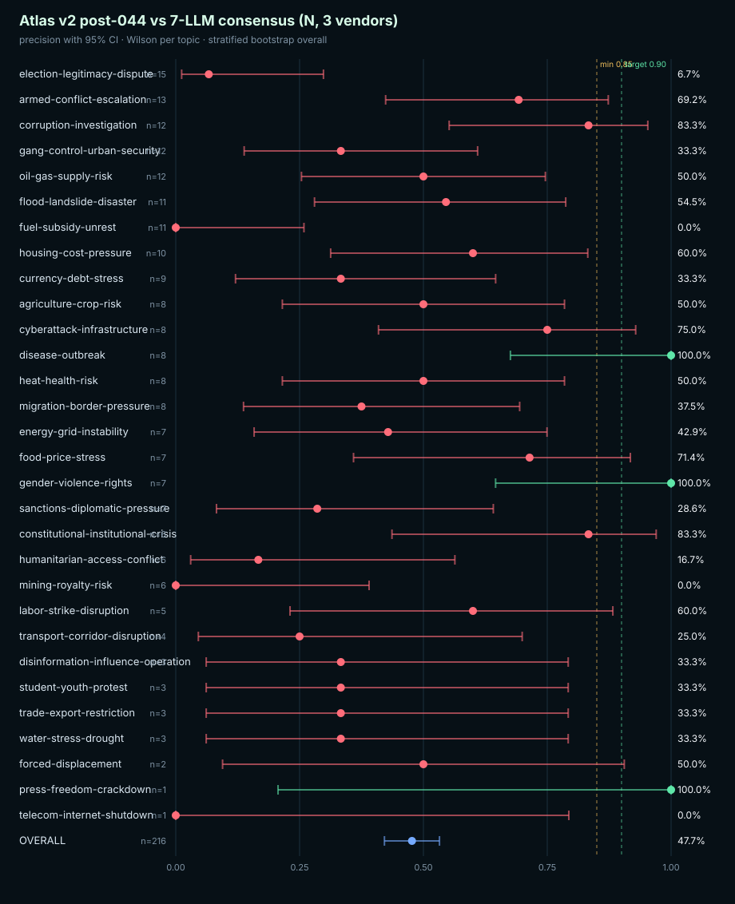

# Atlas v2 post-044 vs 7-LLM consensus (N, 3 vendors)

Schema: `atlas-bootstrap-ci-v1`
Resamples: 10000 · Confidence: 95% · Seed: 20260527

## Overall

| Metric | Value |
|---|---:|
| Labeled | 216 |
| Correct | 103 |
| Incorrect | 113 |
| Unclear (excluded) | 0 |
| Precision | 47.69% |
| Wilson 95% CI | [41.12%, 54.33%] |
| Bootstrap 95% CI (stratified) | [42.13%, 53.24%] |
| Gate minimum | 85% |
| Gate target | 90% |
| Gate result | `fail` |

## Per-topic precision (Wilson 95% CI)

| Topic | n | correct | incorrect | unclear | precision | CI low | CI high | gate |
|---|---:|---:|---:|---:|---:|---:|---:|---|
| `election-legitimacy-dispute` | 15 | 1 | 14 | 0 | 6.67% | 1.19% | 29.82% | `fail` |
| `armed-conflict-escalation` | 13 | 9 | 4 | 0 | 69.23% | 42.37% | 87.32% | `fail` |
| `corruption-investigation` | 12 | 10 | 2 | 0 | 83.33% | 55.20% | 95.30% | `fail` |
| `gang-control-urban-security` | 12 | 4 | 8 | 0 | 33.33% | 13.81% | 60.94% | `fail` |
| `oil-gas-supply-risk` | 12 | 6 | 6 | 0 | 50.00% | 25.38% | 74.62% | `fail` |
| `flood-landslide-disaster` | 11 | 6 | 5 | 0 | 54.55% | 28.01% | 78.73% | `fail` |
| `fuel-subsidy-unrest` | 11 | 0 | 11 | 0 | 0.00% | 0.00% | 25.88% | `fail` |
| `housing-cost-pressure` | 10 | 6 | 4 | 0 | 60.00% | 31.27% | 83.18% | `fail` |
| `currency-debt-stress` | 9 | 3 | 6 | 0 | 33.33% | 12.06% | 64.58% | `fail` |
| `agriculture-crop-risk` | 8 | 4 | 4 | 0 | 50.00% | 21.52% | 78.48% | `fail` |
| `cyberattack-infrastructure` | 8 | 6 | 2 | 0 | 75.00% | 40.93% | 92.85% | `fail` |
| `disease-outbreak` | 8 | 8 | 0 | 0 | 100.00% | 67.56% | 100.00% | `pass_target` |
| `heat-health-risk` | 8 | 4 | 4 | 0 | 50.00% | 21.52% | 78.48% | `fail` |
| `migration-border-pressure` | 8 | 3 | 5 | 0 | 37.50% | 13.68% | 69.43% | `fail` |
| `energy-grid-instability` | 7 | 3 | 4 | 0 | 42.86% | 15.82% | 74.95% | `fail` |
| `food-price-stress` | 7 | 5 | 2 | 0 | 71.43% | 35.89% | 91.78% | `fail` |
| `gender-violence-rights` | 7 | 7 | 0 | 0 | 100.00% | 64.57% | 100.00% | `pass_target` |
| `sanctions-diplomatic-pressure` | 7 | 2 | 5 | 0 | 28.57% | 8.22% | 64.11% | `fail` |
| `constitutional-institutional-crisis` | 6 | 5 | 1 | 0 | 83.33% | 43.65% | 96.99% | `fail` |
| `humanitarian-access-conflict` | 6 | 1 | 5 | 0 | 16.67% | 3.01% | 56.35% | `fail` |
| `mining-royalty-risk` | 6 | 0 | 6 | 0 | 0.00% | 0.00% | 39.03% | `fail` |
| `labor-strike-disruption` | 5 | 3 | 2 | 0 | 60.00% | 23.07% | 88.24% | `fail` |
| `transport-corridor-disruption` | 4 | 1 | 3 | 0 | 25.00% | 4.56% | 69.94% | `fail` |
| `disinformation-influence-operation` | 3 | 1 | 2 | 0 | 33.33% | 6.15% | 79.23% | `fail` |
| `student-youth-protest` | 3 | 1 | 2 | 0 | 33.33% | 6.15% | 79.23% | `fail` |
| `trade-export-restriction` | 3 | 1 | 2 | 0 | 33.33% | 6.15% | 79.23% | `fail` |
| `water-stress-drought` | 3 | 1 | 2 | 0 | 33.33% | 6.15% | 79.23% | `fail` |
| `forced-displacement` | 2 | 1 | 1 | 0 | 50.00% | 9.45% | 90.55% | `fail` |
| `press-freedom-crackdown` | 1 | 1 | 0 | 0 | 100.00% | 20.65% | 100.00% | `pass_target` |
| `telecom-internet-shutdown` | 1 | 0 | 1 | 0 | 0.00% | 0.00% | 79.35% | `fail` |

## Interpretation notes

- Wilson intervals are exact for binomial proportions and behave well when `n` is small or `p` is near 0/1.
- The overall bootstrap CI uses stratified resampling: each topic stratum is resampled with replacement to its original size, then precision is recomputed on the pooled set. This preserves the topic mix and avoids degenerate CIs when one stratum is small.
- Topics with `n = 1` produce wide Wilson intervals by design. Treat them as anecdotal until additional labels arrive.
- A `pass_minimum` row clears the 85% floor but not the 90% target; treat as developing.

## Forest plot

