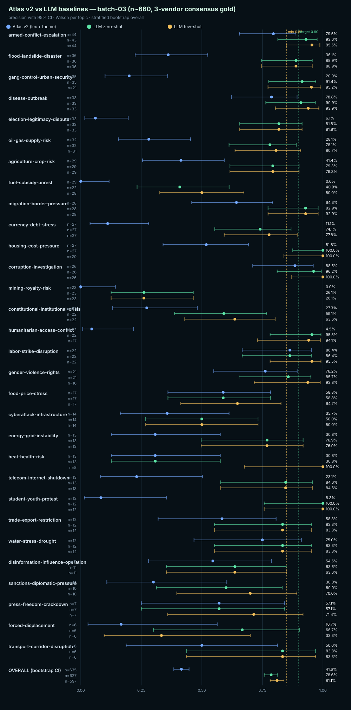

# Atlas v2 vs LLM baselines — batch-03 (n~660, 3-vendor consensus gold)

Schema: `atlas-baseline-compare-v1`
Resamples: 10000 · Confidence: 95% · Seed: 20260527

## Overall precision (gold-aligned outcomes)

| Method | n | correct | precision | Wilson 95% CI | Bootstrap 95% CI | Gate |
|---|---:|---:|---:|---|---|---|
| **Atlas v2 (lex + theme)** | 635 | 264 | 41.57% | [37.80%, 45.45%] | [38.43%, 44.72%] | `fail` |
| **LLM zero-shot** | 627 | 493 | 78.63% | [75.25%, 81.66%] | [75.76%, 81.34%] | `fail` |
| **LLM few-shot** | 597 | 484 | 81.07% | [77.73%, 84.01%] | [78.22%, 83.92%] | `fail` |

## Per-topic precision

| Topic | Method | n | correct | precision | Wilson 95% CI | Gate |
|---|---|---:|---:|---:|---|---|
| `armed-conflict-escalation` | Atlas v2 (lex + theme) | 44 | 35 | 79.55% | [65.50%, 88.85%] | `fail` |
| `armed-conflict-escalation` | LLM zero-shot | 43 | 40 | 93.02% | [81.39%, 97.60%] | `pass_target` |
| `armed-conflict-escalation` | LLM few-shot | 44 | 42 | 95.45% | [84.86%, 98.74%] | `pass_target` |
| `flood-landslide-disaster` | Atlas v2 (lex + theme) | 36 | 13 | 36.11% | [22.48%, 52.43%] | `fail` |
| `flood-landslide-disaster` | LLM zero-shot | 36 | 32 | 88.89% | [74.68%, 95.59%] | `pass_minimum` |
| `flood-landslide-disaster` | LLM few-shot | 36 | 32 | 88.89% | [74.68%, 95.59%] | `pass_minimum` |
| `gang-control-urban-security` | Atlas v2 (lex + theme) | 35 | 7 | 20.00% | [10.04%, 35.89%] | `fail` |
| `gang-control-urban-security` | LLM zero-shot | 35 | 32 | 91.43% | [77.62%, 97.04%] | `pass_target` |
| `gang-control-urban-security` | LLM few-shot | 21 | 20 | 95.24% | [77.33%, 99.15%] | `pass_target` |
| `disease-outbreak` | Atlas v2 (lex + theme) | 33 | 26 | 78.79% | [62.25%, 89.32%] | `fail` |
| `disease-outbreak` | LLM zero-shot | 33 | 30 | 90.91% | [76.43%, 96.86%] | `pass_target` |
| `disease-outbreak` | LLM few-shot | 33 | 31 | 93.94% | [80.39%, 98.32%] | `pass_target` |
| `election-legitimacy-dispute` | Atlas v2 (lex + theme) | 33 | 2 | 6.06% | [1.68%, 19.61%] | `fail` |
| `election-legitimacy-dispute` | LLM zero-shot | 33 | 27 | 81.82% | [65.61%, 91.39%] | `fail` |
| `election-legitimacy-dispute` | LLM few-shot | 33 | 27 | 81.82% | [65.61%, 91.39%] | `fail` |
| `oil-gas-supply-risk` | Atlas v2 (lex + theme) | 32 | 9 | 28.12% | [15.56%, 45.37%] | `fail` |
| `oil-gas-supply-risk` | LLM zero-shot | 32 | 25 | 78.12% | [61.24%, 88.98%] | `fail` |
| `oil-gas-supply-risk` | LLM few-shot | 31 | 25 | 80.65% | [63.72%, 90.81%] | `fail` |
| `agriculture-crop-risk` | Atlas v2 (lex + theme) | 29 | 12 | 41.38% | [25.51%, 59.26%] | `fail` |
| `agriculture-crop-risk` | LLM zero-shot | 29 | 23 | 79.31% | [61.61%, 90.15%] | `fail` |
| `agriculture-crop-risk` | LLM few-shot | 29 | 23 | 79.31% | [61.61%, 90.15%] | `fail` |
| `fuel-subsidy-unrest` | Atlas v2 (lex + theme) | 29 | 0 | 0.00% | [0.00%, 11.70%] | `fail` |
| `fuel-subsidy-unrest` | LLM zero-shot | 22 | 9 | 40.91% | [23.26%, 61.27%] | `fail` |
| `fuel-subsidy-unrest` | LLM few-shot | 28 | 14 | 50.00% | [32.63%, 67.37%] | `fail` |
| `migration-border-pressure` | Atlas v2 (lex + theme) | 28 | 18 | 64.29% | [45.83%, 79.29%] | `fail` |
| `migration-border-pressure` | LLM zero-shot | 28 | 26 | 92.86% | [77.35%, 98.02%] | `pass_target` |
| `migration-border-pressure` | LLM few-shot | 28 | 26 | 92.86% | [77.35%, 98.02%] | `pass_target` |
| `currency-debt-stress` | Atlas v2 (lex + theme) | 27 | 3 | 11.11% | [3.85%, 28.06%] | `fail` |
| `currency-debt-stress` | LLM zero-shot | 27 | 20 | 74.07% | [55.32%, 86.83%] | `fail` |
| `currency-debt-stress` | LLM few-shot | 27 | 21 | 77.78% | [59.24%, 89.39%] | `fail` |
| `housing-cost-pressure` | Atlas v2 (lex + theme) | 27 | 14 | 51.85% | [33.99%, 69.26%] | `fail` |
| `housing-cost-pressure` | LLM zero-shot | 27 | 27 | 100.00% | [87.54%, 100.00%] | `pass_target` |
| `housing-cost-pressure` | LLM few-shot | 20 | 20 | 100.00% | [83.89%, 100.00%] | `pass_target` |
| `corruption-investigation` | Atlas v2 (lex + theme) | 26 | 23 | 88.46% | [71.02%, 96.00%] | `pass_minimum` |
| `corruption-investigation` | LLM zero-shot | 26 | 25 | 96.15% | [81.11%, 99.32%] | `pass_target` |
| `corruption-investigation` | LLM few-shot | 26 | 26 | 100.00% | [87.13%, 100.00%] | `pass_target` |
| `mining-royalty-risk` | Atlas v2 (lex + theme) | 23 | 0 | 0.00% | [0.00%, 14.31%] | `fail` |
| `mining-royalty-risk` | LLM zero-shot | 23 | 6 | 26.09% | [12.55%, 46.47%] | `fail` |
| `mining-royalty-risk` | LLM few-shot | 23 | 6 | 26.09% | [12.55%, 46.47%] | `fail` |
| `constitutional-institutional-crisis` | Atlas v2 (lex + theme) | 22 | 6 | 27.27% | [13.15%, 48.15%] | `fail` |
| `constitutional-institutional-crisis` | LLM zero-shot | 22 | 13 | 59.09% | [38.73%, 76.74%] | `fail` |
| `constitutional-institutional-crisis` | LLM few-shot | 22 | 14 | 63.64% | [42.95%, 80.27%] | `fail` |
| `humanitarian-access-conflict` | Atlas v2 (lex + theme) | 22 | 1 | 4.55% | [0.81%, 21.80%] | `fail` |
| `humanitarian-access-conflict` | LLM zero-shot | 22 | 21 | 95.45% | [78.20%, 99.19%] | `pass_target` |
| `humanitarian-access-conflict` | LLM few-shot | 17 | 16 | 94.12% | [73.02%, 98.95%] | `pass_target` |
| `labor-strike-disruption` | Atlas v2 (lex + theme) | 22 | 19 | 86.36% | [66.66%, 95.25%] | `pass_minimum` |
| `labor-strike-disruption` | LLM zero-shot | 22 | 19 | 86.36% | [66.66%, 95.25%] | `pass_minimum` |
| `labor-strike-disruption` | LLM few-shot | 22 | 21 | 95.45% | [78.20%, 99.19%] | `pass_target` |
| `gender-violence-rights` | Atlas v2 (lex + theme) | 21 | 16 | 76.19% | [54.91%, 89.37%] | `fail` |
| `gender-violence-rights` | LLM zero-shot | 21 | 18 | 85.71% | [65.36%, 95.02%] | `pass_minimum` |
| `gender-violence-rights` | LLM few-shot | 16 | 15 | 93.75% | [71.67%, 98.89%] | `pass_target` |
| `food-price-stress` | Atlas v2 (lex + theme) | 17 | 10 | 58.82% | [36.01%, 78.39%] | `fail` |
| `food-price-stress` | LLM zero-shot | 17 | 10 | 58.82% | [36.01%, 78.39%] | `fail` |
| `food-price-stress` | LLM few-shot | 17 | 11 | 64.71% | [41.30%, 82.69%] | `fail` |
| `cyberattack-infrastructure` | Atlas v2 (lex + theme) | 14 | 5 | 35.71% | [16.34%, 61.24%] | `fail` |
| `cyberattack-infrastructure` | LLM zero-shot | 14 | 7 | 50.00% | [26.80%, 73.20%] | `fail` |
| `cyberattack-infrastructure` | LLM few-shot | 14 | 7 | 50.00% | [26.80%, 73.20%] | `fail` |
| `energy-grid-instability` | Atlas v2 (lex + theme) | 13 | 4 | 30.77% | [12.68%, 57.63%] | `fail` |
| `energy-grid-instability` | LLM zero-shot | 13 | 10 | 76.92% | [49.74%, 91.82%] | `fail` |
| `energy-grid-instability` | LLM few-shot | 13 | 10 | 76.92% | [49.74%, 91.82%] | `fail` |
| `heat-health-risk` | Atlas v2 (lex + theme) | 13 | 4 | 30.77% | [12.68%, 57.63%] | `fail` |
| `heat-health-risk` | LLM zero-shot | 13 | 4 | 30.77% | [12.68%, 57.63%] | `fail` |
| `heat-health-risk` | LLM few-shot | 8 | 8 | 100.00% | [67.56%, 100.00%] | `pass_target` |
| `telecom-internet-shutdown` | Atlas v2 (lex + theme) | 13 | 3 | 23.08% | [8.18%, 50.26%] | `fail` |
| `telecom-internet-shutdown` | LLM zero-shot | 13 | 11 | 84.62% | [57.76%, 95.67%] | `fail` |
| `telecom-internet-shutdown` | LLM few-shot | 13 | 11 | 84.62% | [57.76%, 95.67%] | `fail` |
| `student-youth-protest` | Atlas v2 (lex + theme) | 12 | 1 | 8.33% | [1.49%, 35.39%] | `fail` |
| `student-youth-protest` | LLM zero-shot | 12 | 12 | 100.00% | [75.75%, 100.00%] | `pass_target` |
| `student-youth-protest` | LLM few-shot | 12 | 12 | 100.00% | [75.75%, 100.00%] | `pass_target` |
| `trade-export-restriction` | Atlas v2 (lex + theme) | 12 | 7 | 58.33% | [31.95%, 80.67%] | `fail` |
| `trade-export-restriction` | LLM zero-shot | 12 | 10 | 83.33% | [55.20%, 95.30%] | `fail` |
| `trade-export-restriction` | LLM few-shot | 12 | 10 | 83.33% | [55.20%, 95.30%] | `fail` |
| `water-stress-drought` | Atlas v2 (lex + theme) | 12 | 9 | 75.00% | [46.77%, 91.11%] | `fail` |
| `water-stress-drought` | LLM zero-shot | 12 | 10 | 83.33% | [55.20%, 95.30%] | `fail` |
| `water-stress-drought` | LLM few-shot | 12 | 10 | 83.33% | [55.20%, 95.30%] | `fail` |
| `disinformation-influence-operation` | Atlas v2 (lex + theme) | 11 | 6 | 54.55% | [28.01%, 78.73%] | `fail` |
| `disinformation-influence-operation` | LLM zero-shot | 11 | 7 | 63.64% | [35.38%, 84.83%] | `fail` |
| `disinformation-influence-operation` | LLM few-shot | 11 | 7 | 63.64% | [35.38%, 84.83%] | `fail` |
| `sanctions-diplomatic-pressure` | Atlas v2 (lex + theme) | 10 | 3 | 30.00% | [10.78%, 60.32%] | `fail` |
| `sanctions-diplomatic-pressure` | LLM zero-shot | 10 | 6 | 60.00% | [31.27%, 83.18%] | `fail` |
| `sanctions-diplomatic-pressure` | LLM few-shot | 10 | 7 | 70.00% | [39.68%, 89.22%] | `fail` |
| `press-freedom-crackdown` | Atlas v2 (lex + theme) | 7 | 4 | 57.14% | [25.05%, 84.18%] | `fail` |
| `press-freedom-crackdown` | LLM zero-shot | 7 | 4 | 57.14% | [25.05%, 84.18%] | `fail` |
| `press-freedom-crackdown` | LLM few-shot | 7 | 5 | 71.43% | [35.89%, 91.78%] | `fail` |
| `forced-displacement` | Atlas v2 (lex + theme) | 6 | 1 | 16.67% | [3.01%, 56.35%] | `fail` |
| `forced-displacement` | LLM zero-shot | 6 | 4 | 66.67% | [30.00%, 90.32%] | `fail` |
| `forced-displacement` | LLM few-shot | 6 | 2 | 33.33% | [9.68%, 70.00%] | `fail` |
| `transport-corridor-disruption` | Atlas v2 (lex + theme) | 6 | 3 | 50.00% | [18.76%, 81.24%] | `fail` |
| `transport-corridor-disruption` | LLM zero-shot | 6 | 5 | 83.33% | [43.65%, 96.99%] | `fail` |
| `transport-corridor-disruption` | LLM few-shot | 6 | 5 | 83.33% | [43.65%, 96.99%] | `fail` |

## Interpretation

- LLM outcomes are stratified by the Atlas-assigned topic. Each row contributes one outcome per method: 1 if the method's prediction aligns with the gold judgement of the Atlas assignment, 0 otherwise.
- For LLM rows with `gold_decision == 'correct'`: success means the LLM predicted the same slug as Atlas. For `gold_decision == 'incorrect'`: success means the LLM rejected the Atlas slug (predicted something else or 'none').
- Per-topic CIs are Wilson exact intervals. Overall CIs use stratified bootstrap resampling.
- The LLM zero-shot result here is an upper bound, not a deployment claim: it costs an API call per signal, has no multilingual lex coverage outside the model, and reflects a single inference per row at temperature 0.

## Forest plot

