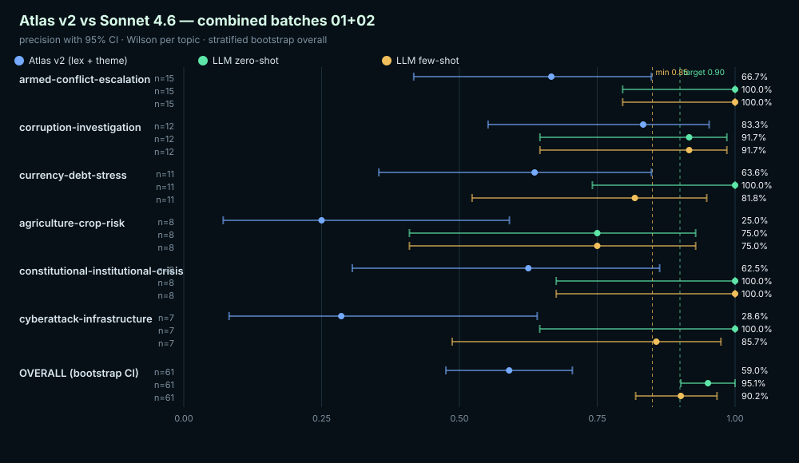

# Atlas v2 vs Sonnet 4.6 — combined batches 01+02

Schema: `atlas-baseline-compare-v1`
Resamples: 10000 · Confidence: 95% · Seed: 20260527

## Overall precision (gold-aligned outcomes)

| Method | n | correct | precision | Wilson 95% CI | Bootstrap 95% CI | Gate |
|---|---:|---:|---:|---|---|---|
| **Atlas v2 (lex + theme)** | 61 | 36 | 59.02% | [46.50%, 70.46%] | [47.54%, 70.49%] | `fail` |
| **LLM zero-shot** | 61 | 58 | 95.08% | [86.51%, 98.31%] | [90.16%, 100.00%] | `pass_target` |
| **LLM few-shot** | 61 | 55 | 90.16% | [80.16%, 95.41%] | [81.97%, 96.72%] | `pass_target` |

## Per-topic precision

| Topic | Method | n | correct | precision | Wilson 95% CI | Gate |
|---|---|---:|---:|---:|---|---|
| `armed-conflict-escalation` | Atlas v2 (lex + theme) | 15 | 10 | 66.67% | [41.71%, 84.82%] | `fail` |
| `armed-conflict-escalation` | LLM zero-shot | 15 | 15 | 100.00% | [79.61%, 100.00%] | `pass_target` |
| `armed-conflict-escalation` | LLM few-shot | 15 | 15 | 100.00% | [79.61%, 100.00%] | `pass_target` |
| `corruption-investigation` | Atlas v2 (lex + theme) | 12 | 10 | 83.33% | [55.20%, 95.30%] | `fail` |
| `corruption-investigation` | LLM zero-shot | 12 | 11 | 91.67% | [64.61%, 98.51%] | `pass_target` |
| `corruption-investigation` | LLM few-shot | 12 | 11 | 91.67% | [64.61%, 98.51%] | `pass_target` |
| `currency-debt-stress` | Atlas v2 (lex + theme) | 11 | 7 | 63.64% | [35.38%, 84.83%] | `fail` |
| `currency-debt-stress` | LLM zero-shot | 11 | 11 | 100.00% | [74.12%, 100.00%] | `pass_target` |
| `currency-debt-stress` | LLM few-shot | 11 | 9 | 81.82% | [52.30%, 94.86%] | `fail` |
| `agriculture-crop-risk` | Atlas v2 (lex + theme) | 8 | 2 | 25.00% | [7.15%, 59.07%] | `fail` |
| `agriculture-crop-risk` | LLM zero-shot | 8 | 6 | 75.00% | [40.93%, 92.85%] | `fail` |
| `agriculture-crop-risk` | LLM few-shot | 8 | 6 | 75.00% | [40.93%, 92.85%] | `fail` |
| `constitutional-institutional-crisis` | Atlas v2 (lex + theme) | 8 | 5 | 62.50% | [30.57%, 86.32%] | `fail` |
| `constitutional-institutional-crisis` | LLM zero-shot | 8 | 8 | 100.00% | [67.56%, 100.00%] | `pass_target` |
| `constitutional-institutional-crisis` | LLM few-shot | 8 | 8 | 100.00% | [67.56%, 100.00%] | `pass_target` |
| `cyberattack-infrastructure` | Atlas v2 (lex + theme) | 7 | 2 | 28.57% | [8.22%, 64.11%] | `fail` |
| `cyberattack-infrastructure` | LLM zero-shot | 7 | 7 | 100.00% | [64.57%, 100.00%] | `pass_target` |
| `cyberattack-infrastructure` | LLM few-shot | 7 | 6 | 85.71% | [48.69%, 97.43%] | `pass_minimum` |

## Interpretation

- LLM outcomes are stratified by the Atlas-assigned topic. Each row contributes one outcome per method: 1 if the method's prediction aligns with the gold judgement of the Atlas assignment, 0 otherwise.
- For LLM rows with `gold_decision == 'correct'`: success means the LLM predicted the same slug as Atlas. For `gold_decision == 'incorrect'`: success means the LLM rejected the Atlas slug (predicted something else or 'none').
- Per-topic CIs are Wilson exact intervals. Overall CIs use stratified bootstrap resampling.
- The LLM zero-shot result here is an upper bound, not a deployment claim: it costs an API call per signal, has no multilingual lex coverage outside the model, and reflects a single inference per row at temperature 0.

## Forest plot

