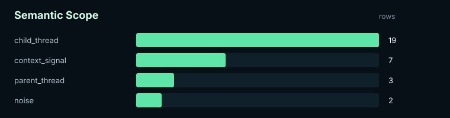
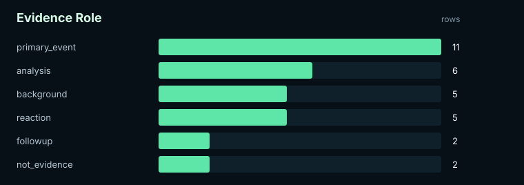
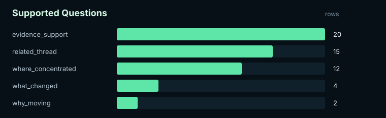
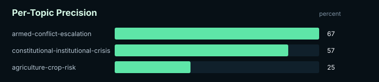

# Atlas V2 Reviewed Batch 01 Validation Report

Label quality: `reviewed`
Schema: `atlas-topic-benchmark-v2`

## Summary

| Metric | Value |
|---|---:|
| Labeled denominator | 30 |
| Correct | 16 |
| Incorrect | 14 |
| Unclear | 2 |
| Precision | 53.33% |
| Gate | `fail` |
| Minimum gate | 85.00% |
| Target gate | 90.00% |

## Visuals

### Semantic Scope

### Evidence Role

### Supported Questions

### Per-Topic Precision

## Per-Topic Precision

| Topic | Labeled | Correct | Incorrect | Unclear | Precision | Gate |
|---|---:|---:|---:|---:|---:|---|
| agriculture-crop-risk | 8 | 2 | 6 | 1 | 25.00% | `fail` |
| armed-conflict-escalation | 15 | 10 | 5 | 1 | 66.67% | `fail` |
| constitutional-institutional-crisis | 7 | 4 | 3 | 0 | 57.14% | `fail` |

## Interpretation Guardrail

This report may be useful for workflow debugging and internal model design. Do not treat non-gold labels as paper-grade evidence. Assistant-pilot labels require human review or adjudication before they can support final claims.
