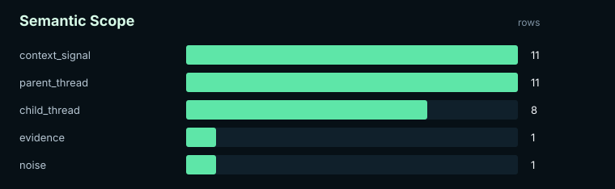
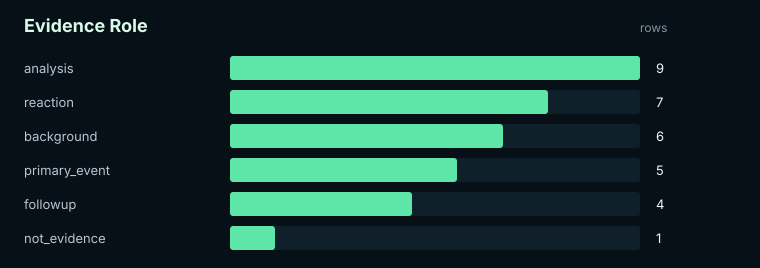
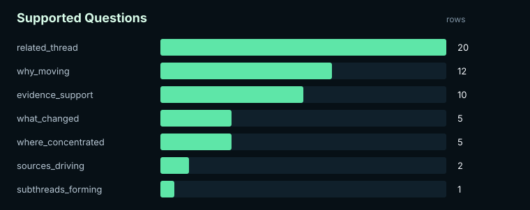
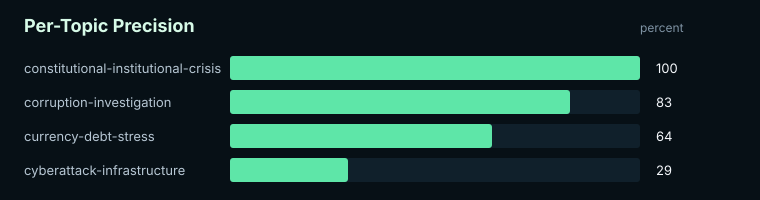

# Atlas v2 stratified batch 02 — reviewed

Label quality: `reviewed`
Schema: `atlas-topic-benchmark-v2`

## Summary

| Metric | Value |
|---|---:|
| Labeled denominator | 31 |
| Correct | 20 |
| Incorrect | 11 |
| Unclear | 1 |
| Precision | 64.52% |
| Gate | `fail` |
| Minimum gate | 85.00% |
| Target gate | 90.00% |

## Visuals

### Semantic Scope

### Evidence Role

### Supported Questions

### Per-Topic Precision

## Per-Topic Precision

| Topic | Labeled | Correct | Incorrect | Unclear | Precision | Gate |
|---|---:|---:|---:|---:|---:|---|
| constitutional-institutional-crisis | 1 | 1 | 0 | 0 | 100.00% | `pass_target` |
| corruption-investigation | 12 | 10 | 2 | 0 | 83.33% | `fail` |
| currency-debt-stress | 11 | 7 | 4 | 1 | 63.64% | `fail` |
| cyberattack-infrastructure | 7 | 2 | 5 | 0 | 28.57% | `fail` |

## Interpretation Guardrail

This report may be useful for workflow debugging and internal model design. Do not treat non-gold labels as paper-grade evidence. Assistant-pilot labels require human review or adjudication before they can support final claims.
