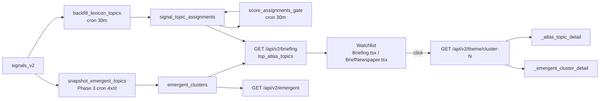

# Context-gap concern and inventory proposal

Date: 2026-05-30
Author: session-recorded conversation between Pedro and Claude

## The concern

Pedro noticed two failures in one session caused by stale or
fragmented project context:

1. **"Cron stopped since 2026-05-27"** — CLAUDE.md handoff stated the
   atlas-topic classifier cron was stopped. Reality (confirmed at
   2026-05-30 22:05): the launchd job has been running every 30 min,
   including the gate-scoring step added this session. Decisions
   downstream of that wrong belief would have been built on sand.
2. **"What's Emerging" new frontend section proposed.** The brief
   already has a Watchlist surface designed to host this kind of
   feed; the right action was to swap the data source, not invent a
   new section. The proposal cost real design work before Pedro
   caught the redundancy.

Pedro's framing: "el proyecto es relativamente grande … podemos usar
algo como Obsidian, no sé. Pues, ¿o cómo hacemos para que … el resto
del proyecto esté aware de lo que cambiamos … sin tener que ir
revisando línea a línea?"

## Diagnosis

Two underlying root causes:

- **Stale state**. CLAUDE.md is chronological (sessions append blocks
  over months) and lacks a machine-verified "current state" header.
  Whatever was true at the last handoff becomes the next agent's
  belief, even when reality has moved.
- **No cross-file map**. No automated record of "endpoint X is
  consumed by component Y", "table T is written by script S and read
  by router R", "cron job J fires on cadence C and last produced
  output at time L". The map lives only in the head of whoever
  touched the code most recently.

## Proposed fix (lightweight, no heavy tooling)

Three layers, ordered by effort:

### 1. `scripts/project_inventory.py` (small, stdlib only)

Scans the repo and emits `docs/state/PROJECT_INVENTORY.md` with:

- **Endpoints**: parse `backend/app/routers/*.py` for `@router.get/post`
  decorators. For each, record path, router file, and SQL tables the
  function body references.
- **Frontend ↔ API map**: scan `frontend-v2/src/**/*.tsx,.ts` for
  `fetch('/api/v2/...')` and `useFocusData`/equivalent hooks. For
  each endpoint, list the components that hit it.
- **DB tables**: parse `backend/migrations/*.sql` for `CREATE TABLE`.
  Cross-reference which routers SELECT/INSERT each table.
- **Cron jobs**: read `~/Library/LaunchAgents/com.atlas.*.plist`,
  check `launchctl list`, tail `~/AtlasLocalWorker/logs/*.log` for
  the most recent run timestamp + exit code.
- **Recent commits**: `git log --since=2w --pretty=oneline` per
  area (backend/frontend/scripts/docs).

Regenerated on demand (`make inventory`) or via a pre-commit hook
that fails the commit when the inventory is out of date.

The point isn't a perfect tool. It's a single readable document an AI
agent can open first to get oriented, without inferring state from a
stale chronological log.

### 2. CLAUDE.md compaction

The file is thousands of lines. Easiest, safest workflow:

- Top 30 lines = **current state**, last-verified timestamps for each
  claim (cron is running / not running, latest production deploy
  commit, latest migration applied, latest snapshot timestamp).
- Body = chronological session blocks, but trim to the last ~3 weeks.
- Older blocks archived to `docs/state/archive/CLAUDE-history-<date>.md`.

The project already has `claude-md-management:claude-md-improver` and
`claude-md-management:revise-claude-md` skills. Use them at session
start.

### 3. Obsidian as the human-curated overlay

`docs/` is already a markdown folder. Open it as an Obsidian vault and
you get:

- Backlinks: every doc that mentions a given concept lists itself
  automatically.
- Graph view: the network of specs / ADRs / handoffs.
- Wiki-style `[[link]]` cross-references for free.

No tooling change to the repo. Pure additive.

## Architecture diagram (recommended)

`docs/ARCHITECTURE.md` with a small Mermaid data-flow diagram, hand-
maintained, high-level only. Something like:

The diagram is small enough that drift is easy to spot at review time.

## Suggested next-session execution

1. Add `scripts/project_inventory.py` and run it once. Read the
   output, fix any obvious drift in CLAUDE.md.
2. Compact CLAUDE.md via the existing skill.
3. Hand-write `docs/ARCHITECTURE.md` with the data-flow diagram.
4. Open `docs/` in Obsidian (no code change). Confirm backlinks
   light up correctly.

Estimated: 1–2 hrs total. The payoff applies to every future
session.

## Anti-patterns to avoid

- Building a heavy CMS / DB-backed knowledge graph. Markdown +
  scripts is enough; complexity here is its own context-loss
  problem.
- Trying to make the inventory tool exhaustive. It only needs to
  catch the obvious "who touches what" map. Edge cases stay in code.
- Letting CLAUDE.md grow without bound again. Set a policy: any
  session block older than 6 weeks is auto-archived at next
  `claude-md-improver` run.
