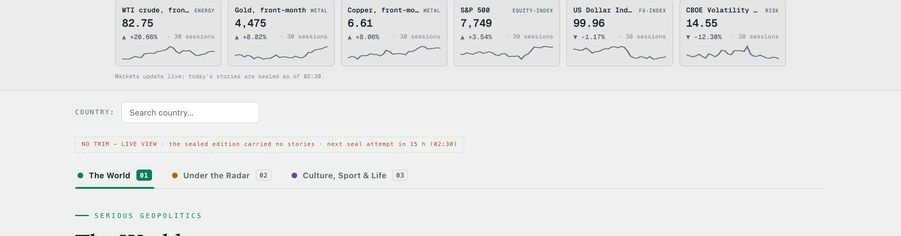
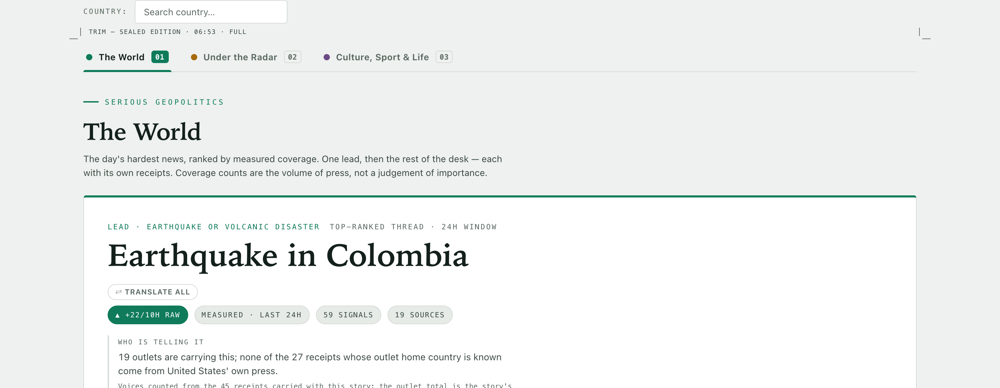
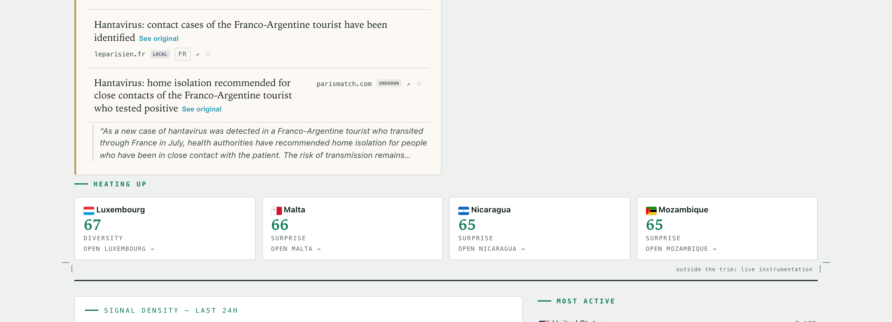
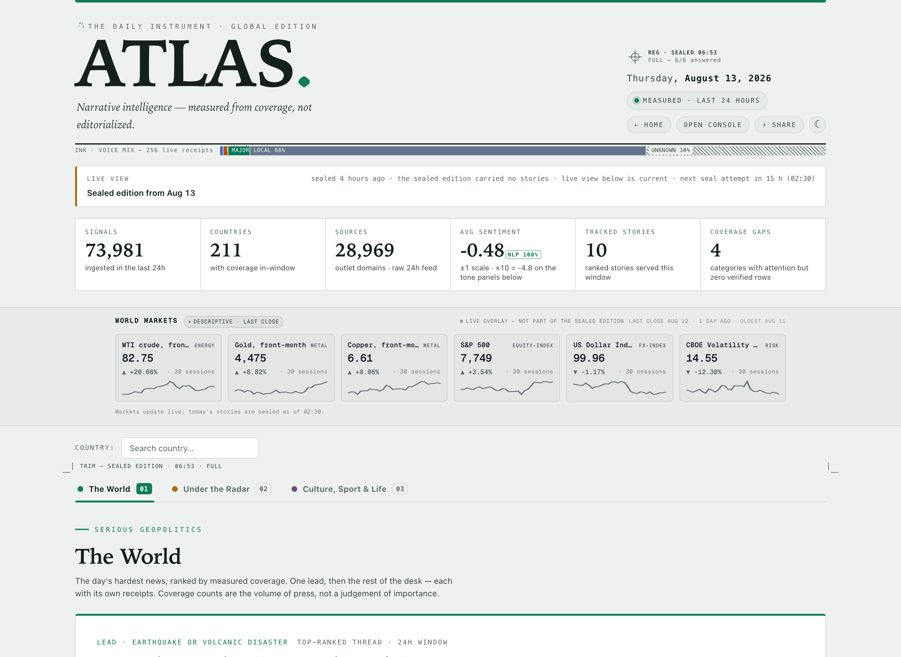
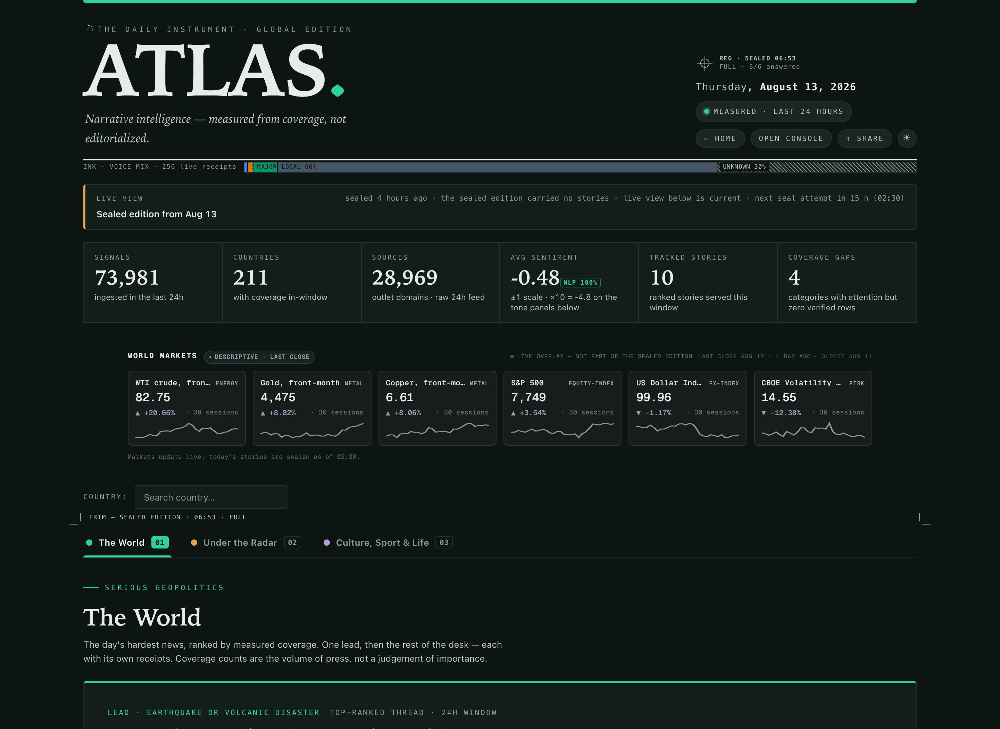
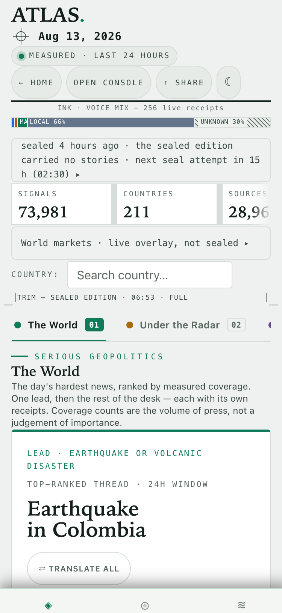
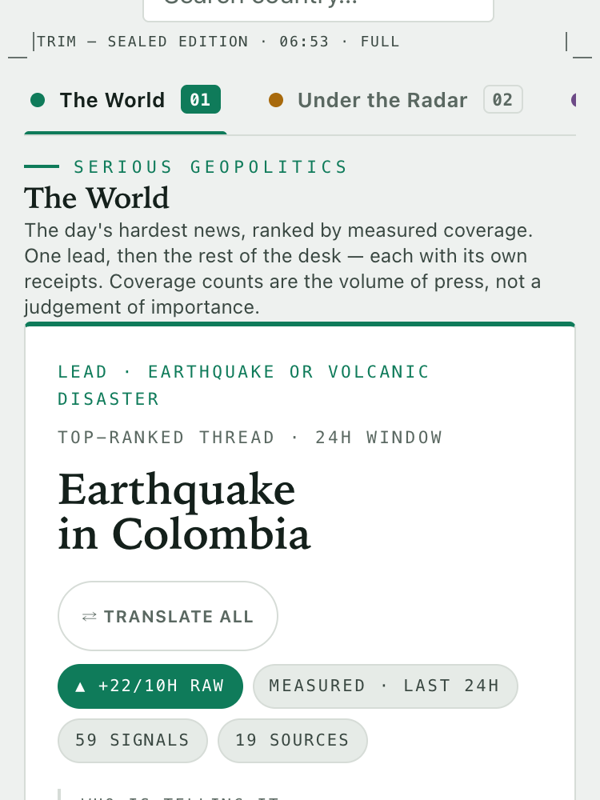

# Printer's Marks on the Brief — mini design exploration

**Date:** 2026-08-13 · **Status:** APPROVED & SHIPPED (all three variants) — Pedro
approved same day ("me gusta" → ship las tres). See the ship addendum at the bottom for
what changed between the mockups below and the shipped state; the body of this doc is
kept as the exploration record (its `?marks=` URLs describe the mockup gate, which no
longer exists — the marks now render by default and `?marks=off` is the kill switch).

**Premise.** The Brief already behaves like a daily press proof: sealed at 02:30, graded,
served with its degradations stated. Prepress furniture — registration marks, color
control strips, crop marks — is the visual language a printed sheet uses to *prove* it was
produced correctly. Same epistemology as Atlas: the sheet carries its own receipts.

**House rule (held throughout):** no pure ornament. Every mark below renders a measurement
the page already owns.

## How to view (dev)

```
/brief?marks=reg          registration mark (masthead corner)
/brief?marks=strip        voice-mix control strip (under the masthead)
/brief?marks=crop         crop marks around the sealed edition
/brief?marks=all          all three
&marksState=full|partial|live   MOCKUP-ONLY seal-state override (screenshots)
```

Files: `frontend-v2/src/components/PrintersMarks.tsx` + `.css`, wiring in
`frontend-v2/src/pages/BriefNewspaper.tsx` (import + one computed block + three gated
placements). All colors ride the `--r-*` reader tokens — both themes hold with zero
hardcoded inks (tier patches reuse the receipt-chip tier hues from `App.css`).

**State of the world at capture time (real, unforced):** last night's seal ran at 06:53
but carried no stories → the page serves the LIVE fallback. So the "live/unregistered"
and "NO TRIM" screenshots below are today's *actual* state; the FULL/PARTIAL states are
forced via `marksState` (the PARTIAL shot still uses the real artifact's readiness —
0/6 answered — only the serving decision is forced; FULL fabricates 6/6, noted below).

---

## Variant 1 — Registration mark: the seal made physical

A registration target (circle + crosshair) in the masthead's right corner, above the
dateline. Registration is *literally* what the nightly seal is: did the press pass land
where it was supposed to?

**Data encoded:**

| Mark state | Renders | Source |
|---|---|---|
| In register — one crisp mark | `REG · SEALED 06:53` / `FULL — 6/6 answered` | `sealed_at` + `status==='ready'` + 5W+H readiness cells |
| Misregistered — a second ink pass offset by **0.9 px per unanswered editorial question** | `PARTIAL — n/6 answered` (ochre) | `status==='degraded'` + readiness; tooltip carries the degradation labels verbatim |
| Unregistered — both passes dashed, clearly apart (red) | `LIVE VIEW — no fresh seal` | `resolveEditionServing` reason codes + next-seal truth |

The grade is not *near* the mark — the grade **is the geometry**. Tooltip carries seal
age, degradation labels, and the next-attempt phrase (all reused from `staleBanner`).


*Forced FULL (6/6 fabricated for the mockup — today's artifact never graded ready).*


*PARTIAL with the real readiness (0/6 answered) — the ochre fringe is the misregistration.*


*REAL state today: unregistered, dashed, red — no fresh seal serving.*

Mobile: the label row is desktop corner furniture; at ≤768px only the glyph renders
(tooltip keeps the data), sitting beside the dateline.

## Variant 2 — Color control strip: the voice mix as ink patches

A press control strip directly under the masthead rule — but the patches are not CMYK,
they are the day's **voices**: every receipt served on the page, classified by the *same*
`resolveTierChip` the receipt rows use (strip and chips can never disagree). Patch width ∝
share; tier hues are the existing chip family (wire blue / state amber / major emerald /
local slate). UNKNOWN never prints as a solid ink — it hatches, with its label on a paper
chip. A present-but-tiny tier shows `<1%`, never `0%`.

**Data encoded:** slug = basis (`256 live receipts` vs `N frozen receipts` when sealed);
each patch = count, share, and the tier's honesty tooltip. Today's real measurement:
LOCAL 66% · UNKNOWN 30% · MAJOR 4% · STATE 1% · WIRE <1% — a finding in itself (the
edition's ink is two-thirds local press, and a third of the ink is unattributable).


## Variant 3 — Crop marks: the sealed edition has a trim

Corner crop marks (hairline pairs, offset from the corner like real trim — the gap is the
bleed) frame **only** the edition panels (tabs + The World / Under the Radar / Culture).
Label: `TRIM — SEALED EDITION · 06:53 · FULL`. Bottom-right, outside the frame:
`outside the trim: live instrumentation`. The instrument strip, markets band, map and
bottom indexes all sit spatially outside — which the markets band already *says* in words
("Live overlay — not part of the sealed edition"); this makes the same sentence spatial.

When the page serves the live fallback there is **no trim** — stated, not decorated:


*REAL state today: the red slug replaces the frame; reason + next seal attempt verbatim.*


*Trim opens under the country filter; tabs and panels are inside.*


*Trim closes above the rule; the map/bottom index below is outside.*

**Honest caveat found while building:** the trim is drawn at *panel* granularity, and the
panels are not 100% sealed content — the HEATING UP strip inside The World reads live
`heat_countries`, and on a sealed serve the standfirst analysis can be live. So today the
frame slightly over-claims. Shipping this variant honestly needs either (a) moving the
live sub-blocks outside the frame, or (b) accepting the panel-granularity footnote in the
trim tooltip. That is exactly the kind of pressure this mark puts on the layout — arguably
a feature: the trim makes mixed provenance *visible* as a design debt.

## Both themes · both sizes






Dark theme verified end-to-end (tokens only). At 375px the strip stacks slug-over-bar,
crop overhang shrinks to 10px to stay inside the 15px page gutter, and the reg label
collapses to glyph+tooltip. There is no print stylesheet on the Brief today (checked) —
if one ever lands, all three marks translate to it for free, which is a point in the
direction's favor.

## Recommendation

**Ship order: V2 → V1 → V3 (V3 after a provenance-cleanliness pass).**

1. **V2 voice-mix strip — strongest.** Always-on (works sealed *and* live), reads as
   furniture but is pure measurement, zero layout risk, and it surfaces a number the
   Brief currently buries (the day's voice composition — 30% unattributable ink is worth
   seeing every day). It is the most literal realization of "a color bar that IS a
   measurement."
2. **V1 registration mark — cheapest, most charming.** The seal grade today lives only in
   a text banner; the misregistration metaphor compresses it into one glance and the
   three states are visually unmistakable. Pairs naturally with V2 (target + control
   strip = one prepress family). Smallest footprint of the three.
3. **V3 crop marks — best story, most debt.** "Outside the trim" matches copy the product
   already speaks, but the frame over-claims at panel granularity (heat strip is live).
   Don't ship until the live sub-blocks are either relocated or footnoted; then it
   becomes the strongest of the three because it reorganizes *space* around provenance.

If only one ships: **V2**. If two: **V2 + V1**.

## Mockup honesty ledger

- `?marksState=` is a screenshot-only override; `full` fabricates 6/6 readiness when the
  real artifact lacks it. Everything else on every mark is live payload data.
- Screenshots captured 2026-08-13 ~11:30 local against prod API via dev server;
  playwright-core + system Chrome (script in session scratchpad, not committed).
- Not run/checked: print stylesheet (none exists), country-filter view with `marks=crop`
  (trim wraps the global edition only — the country panel is out of scope for the
  mockup).

---

## Ship addendum (same day — Pedro approved all three)

Deltas between the mockups above and the shipped state:

1. **Gate inverted.** Marks render by default on `/brief`; `?marks=off` is the kill
   switch. The `?marks=reg|strip|crop|all` selector and the `?marksState=` mockup
   override are **deleted** — a fabricated seal state must not be reachable by URL on a
   shipped page. All three marks now only ever render the real payload.
2. **V3 provenance pass executed (the caveat in the V3 section).** The HEATING UP strip
   reads live `heat_countries`, so it moved out of The World panel to sit **below the
   trim**, beside the other live instrumentation. Side effect (judged acceptable, it was
   never World-specific data): it now shows on all three tabs, not only The World. The
   two remaining live blocks inside the trim — the Editor's Analysis (self-labels basis
   and age) and receipt full-text excerpts (live-fetched, attached to frozen receipts) —
   are named in the trim tooltip instead of relocated: moving the analysis would gut the
   front page, and both already state their own provenance on themselves.
3. **Tests added:** `PrintersMarks.test.tsx` (7) freezes the pure builders — grade
   derivation (partial ≠ answered), live-state reasons passed verbatim, null artifact
   never fabricates, voice-mix uses the receipt-chip classifier and sums to its total,
   zero receipts → no strip.
4. Verified post-ship in the browser: default `/brief` renders all three marks with
   today's real state (unregistered + NO TRIM + 256-live-receipt strip), `?marks=off`
   removes every mark, heat strip sits after the culture panel and before the map row,
   no stale references, build + full suite green (1716).
